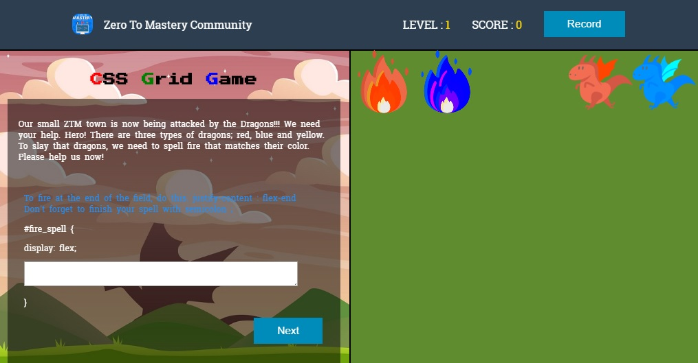

# CSS_Grid_LearnGame
> This will be a game to learn CSS Grid in a Game Mode Style, to make learning more fun! 



It's bascially a froggy-flexbox style game app built with React.js. Currently only 3 stages have been developed. After stage #4 is totally up to you. Be creative! If you want to enjoy this app in your local computer, then download the source and have your computer setup with Node.js. Then you are good to go. If you feel like you want to contribute, then please read [CONTRIBUTING.md](https://github.com/zero-to-mastery/CSS_Grid_LearnGame/blob/master/CONTRIBUTING.md) before you make a pull request. 

## Getting Started

If you want to download and run this website on your computer, you need to install Node.js first because it's built with React.js

### Prerequisites

If you don't have Node.js setup on your computer, please click below link and download it first.

* [Node.js](https://nodejs.org/en/) - The official Node.js website to download

### Installing

If you already have Node.js, then follow below step.

On your terminal:

```
cd /c/<folder_path>
npm i
npm start

```

So it will automatically run in your local server.

## Built With

* [React.js](https://reactjs.org/) - The official React.js website
* [Lodash](https://lodash.com/) - The official Lodash website

## License

This project is licensed under the MIT License - see the [LICENSE.md](https://github.com/zero-to-mastery/CSS_Grid_LearnGame/blob/master/LICENSE) file for details

## Contributing

Please read [CONTRIBUTING.md](https://github.com/zero-to-mastery/CSS_Grid_LearnGame/blob/master/CONTRIBUTING.md) for details on our code of conduct, and the process for submitting pull requests.

## Acknowledgments

* [Freepik](https://www.freepik.com/free-photos-vectors/background) - Background image created by Freepik 
* [Flaticon](https://www.flaticon.com/) - Dragon icons made by Flaticon

## Meta

* [ZeroToMaster Web](https://zerotomastery.io/) - The official ZeroToMastery website
* [HowToContribute](https://github.com/zero-to-mastery/start-here-guidelines) - Open source contribution guideline for all Zero to Master course students

